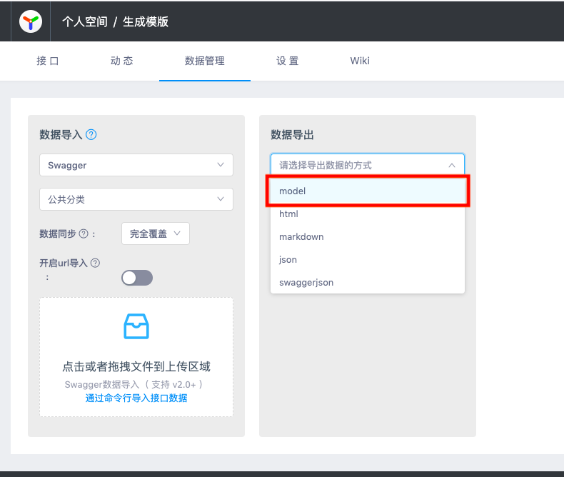
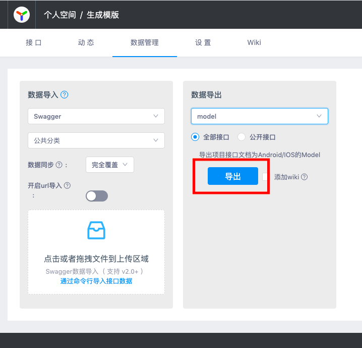

# yapi-plugin-export-model

通过`yapi`的‘导出数据’中的`model`选项导出对应API的`Android`和`iOS`对应的Model文件。

## 安装插件

- 安装ykit（已经装过的请忽略）

  ```shell
  npm install -g ykit
  ```

- 安装yapi（已经装过的请忽略）

  ```shell
  npm install -g yapi-cli --registry https://registry.npm.taobao.org
  ```

- 安装插件

  ```shell
  git clone https://github.com/JessYan0913/yapi-plugin-export-model.git

  mv yapi-plugin-export-model ~/yapi/vendors/node_modules/yapi-plugin-export-model

  cd ~/yapi/vendors

  npm install
  ```

- 重启`Yapi`服务

  ```shell
  npm install

  ykit pack -m

  node server/app.js
  ```

##  配置插件

在`yapi`的根目录下找到`config.json`文件，在`plugins`配置项，加入`yapi-plugin-export-model`插件，

```shell
{
  "port": "3000",
  "adminAccount": "admin@admin.com",
  "timeout": 120000,
  ...
  "plugins": [
    {
      "name": "export-model",
      "options": {
        "baseRequest": {
          "java": "TKReq",
          "oc": "TKReq"
        },
        "baseResponse": {
          "java": "TKRes",
          "oc": "TKRes"
        }
      }
    }
  ]
}
```


> `baseRequest`和`baseResponse`是`RequestModel`和`ResponseModel`的基类配置，即所有的`RequestModel`和 `ResponseModel`对象都会继承该配置的类型。
>
> `baseRequest`和`baseResponse`是非必须配置。

## 导出Model

选择项目中的`数据管理`选项，在`数据导出`中选择`model`选项，点击`导出`即可完成项目API的`Android/iOS`的`Model`。





导出文件名为`model.zip`的压缩包，解压后目录结构如下：

```shell
|-model
  |-Android
  |  |-APITest
  |  |  |-APITestReq.java
  |  |  |-APITestRes.java
  |-iOS
  |  |-APITest
  |  |  |-APITestReq.h
  |  |  |-APITestReq.m
  |  |  |-APITestRes.h
  |  |  |-APITestRes.m
```

## API示例

<h3 class="curproject-name"> 生成模版 </h1>

### 公共分类

#### json-object请求

#### 基本信息

**Path：** /export/json-object

**Method：** POST

**接口描述：**

#### 请求参数

**Headers**

| 参数名称  | 参数值  |  是否必须 | 示例  | 备注  |
| ------------ | ------------ | ------------ | ------------ | ------------ |
| Content-Type  |  application/json | 是  |   |   |
**Body**

<table>
  <thead class="ant-table-thead">
    <tr>
      <th key=name>名称</th><th key=type>类型</th><th key=required>是否必须</th><th key=default>默认值</th><th key=desc>备注</th><th key=sub>其他信息</th>
    </tr>
  </thead><tbody className="ant-table-tbody"><tr key=0-0><td key=0><span style="padding-left: 0px"><span style="color: #8c8a8a"></span> id</span></td><td key=1><span>integer</span></td><td key=2>必须</td><td key=3></td><td key=4><span style="white-space: pre-wrap"></span></td><td key=5></td></tr><tr key=0-1><td key=0><span style="padding-left: 0px"><span style="color: #8c8a8a"></span> name</span></td><td key=1><span>string</span></td><td key=2>必须</td><td key=3></td><td key=4><span style="white-space: pre-wrap"></span></td><td key=5></td></tr><tr key=0-2><td key=0><span style="padding-left: 0px"><span style="color: #8c8a8a"></span> array</span></td><td key=1><span>object []</span></td><td key=2>必须</td><td key=3></td><td key=4><span style="white-space: pre-wrap"></span></td><td key=5><p key=3><span style="font-weight: '700'">item 类型: </span><span>object</span></p></td></tr><tr key=0-2-0><td key=0><span style="padding-left: 20px"><span style="color: #8c8a8a">├─</span> title</span></td><td key=1><span>string</span></td><td key=2>必须</td><td key=3></td><td key=4><span style="white-space: pre-wrap"></span></td><td key=5></td></tr><tr key=0-3><td key=0><span style="padding-left: 0px"><span style="color: #8c8a8a"></span> field_1</span></td><td key=1><span>array []</span></td><td key=2>必须</td><td key=3></td><td key=4><span style="white-space: pre-wrap"></span></td><td key=5><p key=3><span style="font-weight: '700'">item 类型: </span><span>array</span></p></td></tr><tr key=array-2><td key=0><span style="padding-left: 20px"><span style="color: #8c8a8a">├─</span> </span></td><td key=1><span></span></td><td key=2>非必须</td><td key=3></td><td key=4><span style="white-space: pre-wrap"></span></td><td key=5></td></tr><tr key=array-1><td key=0><span style="padding-left: 40px"><span style="color: #8c8a8a">├─</span> </span></td><td key=1><span></span></td><td key=2>非必须</td><td key=3></td><td key=4><span style="white-space: pre-wrap"></span></td><td key=5></td></tr><tr key=0-4><td key=0><span style="padding-left: 0px"><span style="color: #8c8a8a"></span> object1</span></td><td key=1><span>object</span></td><td key=2>必须</td><td key=3></td><td key=4><span style="white-space: pre-wrap"></span></td><td key=5></td></tr><tr key=0-4-0><td key=0><span style="padding-left: 20px"><span style="color: #8c8a8a">├─</span> id</span></td><td key=1><span>string</span></td><td key=2>必须</td><td key=3></td><td key=4><span style="white-space: pre-wrap"></span></td><td key=5></td></tr><tr key=0-4-1><td key=0><span style="padding-left: 20px"><span style="color: #8c8a8a">├─</span> object2</span></td><td key=1><span>object</span></td><td key=2>必须</td><td key=3></td><td key=4><span style="white-space: pre-wrap"></span></td><td key=5></td></tr><tr key=0-4-1-0><td key=0><span style="padding-left: 40px"><span style="color: #8c8a8a">├─</span> id</span></td><td key=1><span>string</span></td><td key=2>必须</td><td key=3></td><td key=4><span style="white-space: pre-wrap"></span></td><td key=5></td></tr><tr key=0-4-1-1><td key=0><span style="padding-left: 40px"><span style="color: #8c8a8a">├─</span> age</span></td><td key=1><span>string</span></td><td key=2>必须</td><td key=3></td><td key=4><span style="white-space: pre-wrap"></span></td><td key=5></td></tr>
               </tbody>
              </table>

### 返回数据

<table>
  <thead class="ant-table-thead">
    <tr>
      <th key=name>名称</th><th key=type>类型</th><th key=required>是否必须</th><th key=default>默认值</th><th key=desc>备注</th><th key=sub>其他信息</th>
    </tr>
  </thead><tbody className="ant-table-tbody"><tr key=0-0><td key=0><span style="padding-left: 0px"><span style="color: #8c8a8a"></span> id</span></td><td key=1><span>string</span></td><td key=2>必须</td><td key=3></td><td key=4><span style="white-space: pre-wrap"></span></td><td key=5></td></tr><tr key=0-1><td key=0><span style="padding-left: 0px"><span style="color: #8c8a8a"></span> name</span></td><td key=1><span>string</span></td><td key=2>必须</td><td key=3></td><td key=4><span style="white-space: pre-wrap"></span></td><td key=5></td></tr>
               </tbody>
              </table>
## Model示例

### Android

- Request

`JsonObjectReq.java`

```java
import java.util.List;

public class JsonObjectReq extends TKReq {

    public class Array {

        private String title;

        public void setTitle(String title) {
            this.title = title;
        }

        public String getTitle() {
            return this.title;
        }

    }

    public class Object1Object2 {

        private String id;

        private String age;

        public void setId(String id) {
            this.id = id;
        }

        public String getId() {
            return this.id;
        }

        public void setAge(String age) {
            this.age = age;
        }

        public String getAge() {
            return this.age;
        }

    }

    public class Object1 {

        private String id;

        private Object2 object2;

        public void setId(String id) {
            this.id = id;
        }

        public String getId() {
            return this.id;
        }

        public void setObject2(Object2 object2) {
            this.object2 = object2;
        }

        public Object2 getObject2() {
            return this.object2;
        }

    }

    private int id;

    private String name;

    private List<Array> array;

    private List<List<String>> field1;

    private Object1 object1;

    public void setId(int id) {
        this.id = id;
    }

    public int getId() {
        return this.id;
    }

    public void setName(String name) {
        this.name = name;
    }

    public String getName() {
        return this.name;
    }

    public void setArray(List<Array> array) {
        this.array = array;
    }

    public List<Array> getArray() {
        return this.array;
    }

    public void setField1(List<List<String>> field1) {
        this.field1 = field1;
    }

    public List<List<String>> getField1() {
        return this.field1;
    }

    public void setObject1(Object1 object1) {
        this.object1 = object1;
    }

    public Object1 getObject1() {
        return this.object1;
    }

}
```


- Response

`JsonObjectRes.java`

```java
import java.util.List;

public class JsonObjectRes extends TKRes {

    private String id;

    private String name;

    public void setId(String id) {
        this.id = id;
    }

    public String getId() {
        return this.id;
    }

    public void setName(String name) {
        this.name = name;
    }

    public String getName() {
        return this.name;
    }

}

```

### iOS

- Request

`JsonObjectReq.h`

```objc
#import "TKReq.h"

NS_ASSUME_NONNULL_BEGIN

@protocol JsonObjectReqArray;

@protocol JsonObjectReqObject1Object2;

@protocol JsonObjectReqObject1;


@interface JsonObjectReqArray : JSONModel

@property (nonatomic) NSString *title;

@end

@interface JsonObjectReqObject1Object2 : JSONModel

@property (nonatomic) NSString *id;

@property (nonatomic) NSString *age;

@end

@interface JsonObjectReqObject1 : JSONModel

@property (nonatomic) NSString *id;

@property (nonatomic) Object2<Optional> *object2;

@end

@interface JsonObjectReq : TKReq

@property (nonatomic) int id;

@property (nonatomic) NSString *name;

@property (nonatomic) NSArray<Array *> *array;

@property (nonatomic) NSArray<NSArray<String *> *> *field1;

@property (nonatomic) Object1<Optional> *object1;

@end

NS_ASSUME_NONNULL_END
```


`JsonObjectReq.m`

```objc
#import "JsonObjectReq.h"

@implementation JsonObjectReq

@end

@implementation JsonObjectReqArray

@end

@implementation JsonObjectReqObject1Object2

@end

@implementation JsonObjectReqObject1

@end
```


- Response

`JsonObjectRes.h`

```objc
#import "TKRes.h"

NS_ASSUME_NONNULL_BEGIN


@interface JsonObjectRes : TKRes

@property (nonatomic) NSString *id;

@property (nonatomic) NSString *name;

@end

NS_ASSUME_NONNULL_END
```


`JsonObjectRes.m`

```objc
#import "JsonObjectRes.h"

@implementation JsonObjectRes

@end
```

